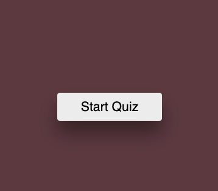

# 04 Web APIs: Code Quiz

## The Task

At some point in my journey to become a full-stack web developer, I will likely be asked to complete a coding assessment&mdash;perhaps as part of an interview process. A typical coding assessment includes both multiple-choice questions and interactive coding challenges. 

This app will run in the browser and will feature dynamically updated HTML and CSS powered by JavaScript code that you write. It will have a clean, polished, and responsive user interface. 

## User Story

```
AS A coding boot camp student
I WANT to take a timed quiz on JavaScript fundamentals that stores high scores
SO THAT I can gauge my progress compared to my peers
```

## Acceptance Criteria

```
GIVEN I am taking a code quiz
WHEN I click the start button
THEN a timer starts and I am presented with a question
WHEN I answer a question
THEN I am presented with another question
WHEN I answer a question incorrectly
THEN time is subtracted from the clock
WHEN all questions are answered or the timer reaches 0
THEN the game is over
WHEN the game is over
THEN I can save my initials and my score
```

## Mock-Up

The following image demonstrates the application functionality:

You click on 'Start Quiz


You click on 'Start Quiz


You click on 'Start Quiz

