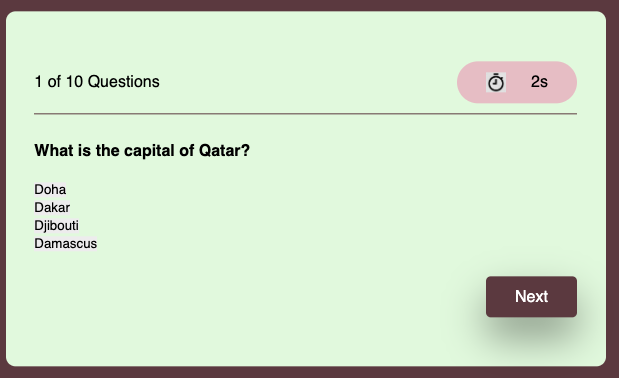

# Country Capitals Code Quiz

## The Task

At some point in my journey to become a full-stack web developer, I will likely be asked to complete a coding assessment&mdash;perhaps as part of an interview process. A typical assessment includes both multiple-choice questions and interactive coding challenges. I have created my own assessment based on this. 

This app will run in the browser and features dynamically updated HTML and CSS powered by JavaScript code that I have written.

## User Story

```
AS A coding boot camp student
I WANT to take a timed quiz on JavaScript fundamentals that stores high scores
SO THAT I can gauge my progress compared to my peers
```

## Acceptance Criteria

```
GIVEN I am taking a code quiz
WHEN I click the start button
THEN a timer starts and I am presented with a question
WHEN I answer a question
THEN I am presented with another question
WHEN I answer a question incorrectly
THEN time is subtracted from the clock
WHEN all questions are answered or the timer reaches 0
THEN the game is over
WHEN the game is over
THEN I can save my initials and my score
```
## Installation

N/A


## Usage

The following image demonstrates the application functionality:

You click on 'Start Quiz


The question and option cards



Scoreboards


## Notes 

11/25/23 UPDATE: Working on refactoring and fixing this web application. 

12/4/23 UPDATE: All issues have been fixed and implemented new features. 

New features: 

Scoreboard

Ability to enter and save initials and score

"View Scores" modal

"Play Again" button

## Links

URL to the deployed site: 
[Quiz Game URL](https://gera1313.github.io/4-Code-Quiz/)


## Credits

Thank you to the BCS Learning Assitants for guiding me and helping me on the right path. 

Also: 
[How to make a simple JavaScript quiz](https://simplestepscode.com/javascript-quiz-tutorial/)

## License

## [](https://opensource.org/licenses/MIT)